# Panfactum Scripts Dependency Graph

This document provides a comprehensive dependency analysis of all scripts in `packages/nix/packages/scripts/`.

## Internal Script Dependencies

```mermaid
graph TD
    %% Core utility scripts (no internal dependencies)
    pf-buildkit-validate.sh
    pf-get-commit-hash.sh
    pf-get-local-module-hash.sh
    pf-get-open-port.sh
    pf-get-repo-variables.sh
    pf-get-vault-token.sh
    pf-sops-set-profile.sh
    pf-tf-init.sh
    pf-velero-snapshot-gc.sh
    pf-voluntary-disruptions-disable.sh
    pf-voluntary-disruptions-enable.sh
    wait-on-image.sh
    enter-shell-local.sh

    %% Level 1 dependencies (depend only on core utilities)
    pf-get-repo-variables.sh --> pf-get-aws-profile-for-kube-context.sh
    pf-get-vault-token.sh --> pf-get-db-creds.sh
    pf-buildkit-validate.sh --> pf-buildkit-clear-cache.sh
    pf-buildkit-validate.sh --> pf-buildkit-get-address.sh
    pf-buildkit-validate.sh --> pf-buildkit-record-build.sh
    pf-buildkit-validate.sh --> pf-buildkit-scale-down.sh
    pf-get-commit-hash.sh --> pf-wf-git-checkout.sh
    pf-get-repo-variables.sh --> pf-eks-suspend.sh
    pf-get-repo-variables.sh --> pf-tunnel.sh
    pf-get-vault-token.sh --> pf-tunnel.sh
    pf-get-repo-variables.sh --> pf-vpc-network-test.sh

    %% Level 2 dependencies
    pf-buildkit-validate.sh --> pf-buildkit-scale-up.sh
    pf-buildkit-record-build.sh --> pf-buildkit-scale-up.sh
    pf-get-aws-profile-for-kube-context.sh --> pf-eks-resume.sh
    pf-get-aws-profile-for-kube-context.sh --> pf-eks-suspend.sh
    pf-get-repo-variables.sh --> pf-db-tunnel.sh
    pf-get-vault-token.sh --> pf-db-tunnel.sh
    pf-get-db-creds.sh --> pf-db-tunnel.sh
    pf-tunnel.sh --> pf-db-tunnel.sh
    pf-get-repo-variables.sh --> docker-credential-panfactum.sh
    pf-get-aws-profile-for-kube-context.sh --> docker-credential-panfactum.sh

    %% Level 3+ dependencies (complex dependencies)
    pf-buildkit-validate.sh --> pf-buildkit-tunnel.sh
    pf-get-repo-variables.sh --> pf-buildkit-tunnel.sh
    pf-buildkit-scale-up.sh --> pf-buildkit-tunnel.sh
    pf-buildkit-get-address.sh --> pf-buildkit-tunnel.sh
    pf-tunnel.sh --> pf-buildkit-tunnel.sh

    pf-buildkit-validate.sh --> pf-buildkit-build.sh
    pf-get-repo-variables.sh --> pf-buildkit-build.sh
    pf-get-open-port.sh --> pf-buildkit-build.sh
    pf-buildkit-tunnel.sh --> pf-buildkit-build.sh

    %% Styling
    classDef coreUtils fill:#e1f5fe
    classDef buildkit fill:#f3e5f5
    classDef database fill:#e8f5e8
    classDef kubernetes fill:#fff3e0
    classDef aws fill:#fce4ec
    classDef general fill:#f5f5f5

    class pf-buildkit-validate.sh,pf-get-repo-variables.sh,pf-get-vault-token.sh,pf-get-commit-hash.sh,pf-get-local-module-hash.sh,pf-get-open-port.sh,pf-sops-set-profile.sh coreUtils
    class pf-buildkit-build.sh,pf-buildkit-clear-cache.sh,pf-buildkit-get-address.sh,pf-buildkit-record-build.sh,pf-buildkit-scale-down.sh,pf-buildkit-scale-up.sh,pf-buildkit-tunnel.sh buildkit
    class pf-db-tunnel.sh,pf-get-db-creds.sh database
    class pf-eks-resume.sh,pf-eks-suspend.sh,pf-velero-snapshot-gc.sh,pf-voluntary-disruptions-disable.sh,pf-voluntary-disruptions-enable.sh kubernetes
    class pf-get-aws-profile-for-kube-context.sh,docker-credential-panfactum.sh aws
    class pf-tunnel.sh,pf-vpc-network-test.sh,pf-wf-git-checkout.sh,wait-on-image.sh,enter-shell-local.sh,pf-tf-init.sh general
```



## Dependency Clusters

### Core Utilities (No Internal Dependencies)
These scripts are foundational and don't depend on other scripts:
- `pf-buildkit-validate.sh` - BuildKit validation constants
- `pf-get-commit-hash.sh` - Git commit hash resolution
- `pf-get-local-module-hash.sh` - Local module hashing
- `pf-get-open-port.sh` - Find available ports
- `pf-get-repo-variables.sh` - Repository configuration
- `pf-get-vault-token.sh` - Vault authentication
- `pf-sops-set-profile.sh` - SOPS profile management
- `pf-tf-init.sh` - Terraform initialization
- `pf-velero-snapshot-gc.sh` - Velero cleanup
- `pf-voluntary-disruptions-disable.sh` - K8s disruption control
- `pf-voluntary-disruptions-enable.sh` - K8s disruption control
- `wait-on-image.sh` - ECR image availability
- `enter-shell-local.sh` - Shell initialization

### BuildKit Cluster
Hierarchical dependency structure for BuildKit operations:
```
pf-buildkit-validate.sh (core)
├── pf-buildkit-clear-cache.sh
├── pf-buildkit-get-address.sh
├── pf-buildkit-record-build.sh
├── pf-buildkit-scale-down.sh
└── pf-buildkit-scale-up.sh
    └── pf-buildkit-tunnel.sh
        └── pf-buildkit-build.sh
```

### Database Access Cluster
```
pf-get-vault-token.sh → pf-get-db-creds.sh → pf-db-tunnel.sh
pf-get-repo-variables.sh → pf-tunnel.sh → pf-db-tunnel.sh
```

### AWS/EKS Cluster
```
pf-get-repo-variables.sh → pf-get-aws-profile-for-kube-context.sh
                        ├── pf-eks-resume.sh
                        ├── pf-eks-suspend.sh
                        └── docker-credential-panfactum.sh
```

## Refactoring Priority

### High Priority (Independent Scripts)
These can be refactored first as they have no internal dependencies:
1. `pf-get-open-port.sh`
2. `pf-get-local-module-hash.sh`
3. `pf-sops-set-profile.sh`
4. `pf-tf-init.sh`
5. `wait-on-image.sh`
6. `pf-velero-snapshot-gc.sh`
7. `pf-voluntary-disruptions-*`

### Medium Priority (Core Dependencies)
These are depended upon by many other scripts:
1. `pf-get-repo-variables.sh` (used by 8 scripts)
2. `pf-get-vault-token.sh` (used by 3 scripts)
3. `pf-buildkit-validate.sh` (used by 7 BuildKit scripts)
4. `pf-get-commit-hash.sh` (used by 1 script)

### Low Priority (Complex Dependencies)
These should be refactored last due to complex dependency chains:
1. `pf-buildkit-build.sh` (depends on 4 scripts)
2. `pf-db-tunnel.sh` (depends on 4 scripts)
3. `docker-credential-panfactum.sh` (depends on 2 scripts)

## External Tool Dependencies Summary

### Most Common External Dependencies
1. **kubectl** - Used by 10 scripts (K8s operations)
2. **jq** - Used by 10 scripts (JSON processing)
3. **aws** - Used by 6 scripts (AWS operations)
4. **grep/awk** - Used by 8 scripts (text processing)
5. **vault** - Used by 3 scripts (secrets management)

### Specialized Tools
- **terragrunt** - Infrastructure deployment
- **buildctl** - Container building
- **autossh** - Reliable SSH tunneling
- **fzf** - Interactive selection
- **yq** - YAML processing

## Notes for Refactoring

1. **Shared Utilities**: Consider creating a shared utilities module for common operations like JSON/YAML processing, Kubernetes operations, and AWS interactions.

2. **Configuration Management**: `pf-get-repo-variables.sh` is heavily used and should be converted to a core configuration service.

3. **Authentication Layer**: Vault and AWS authentication logic is scattered across multiple scripts and should be centralized.

4. **BuildKit Operations**: The BuildKit cluster has a clear hierarchy and could be refactored into a single command with subcommands.

5. **Error Handling**: All scripts use similar error handling patterns that could be standardized in the CLI framework.