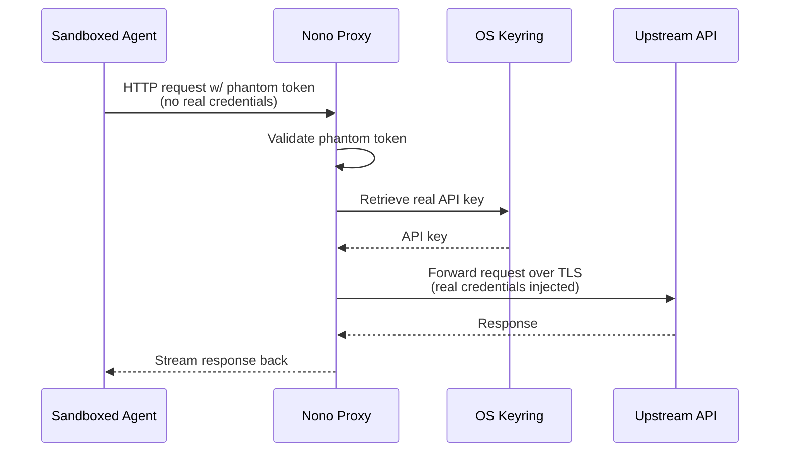

---
footnotes:

  - "Docs: [nono.sh/docs/cli/features/credential-injection](https://nono.sh/docs/cli/features/credential-injection)"
---

## Nono: Credential Sandboxing

```mermaid
sequenceDiagram
    participant Agent as Sandboxed Agent
    participant Proxy as Nono Proxy
    participant Keyring as OS Keyring
    participant API as Upstream API

    Agent->>Proxy: HTTP request w/ phantom token<br/>(no real credentials)
    Proxy->>Proxy: Validate phantom token
    Proxy->>Keyring: Retrieve real API key
    Keyring-->>Proxy: API key
    Proxy->>API: Forward request over TLS<br/>(real credentials injected)
    API-->>Proxy: Response
    Proxy-->>Agent: Stream response back
```
