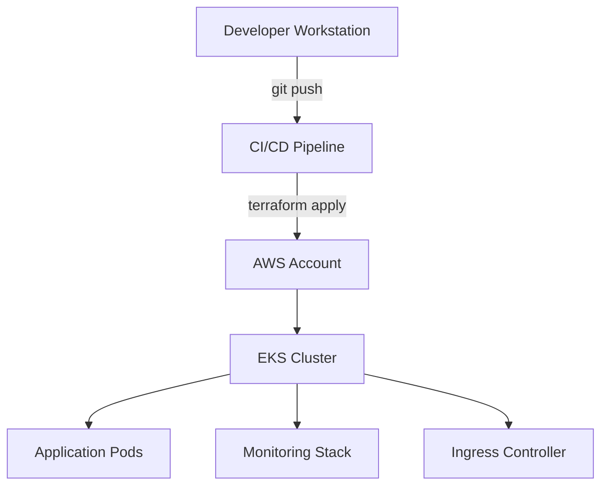

## Architecture Overview

```mermaid
flowchart TD
    A[Developer Workstation] -->|git push| B[CI/CD Pipeline]
    B -->|terraform apply| C[AWS Account]
    C --> D[EKS Cluster]
    D --> E[Application Pods]
    D --> F[Monitoring Stack]
    D --> G[Ingress Controller]
```
